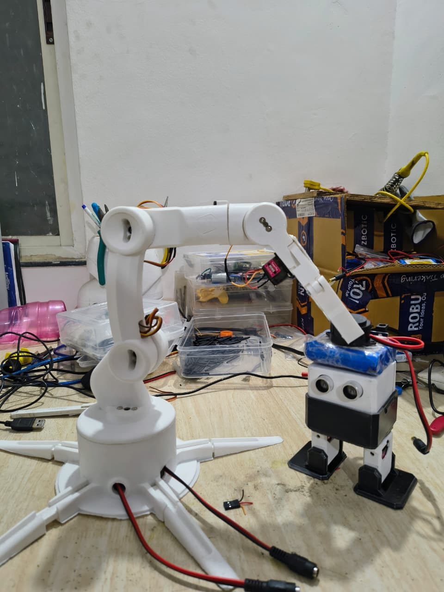
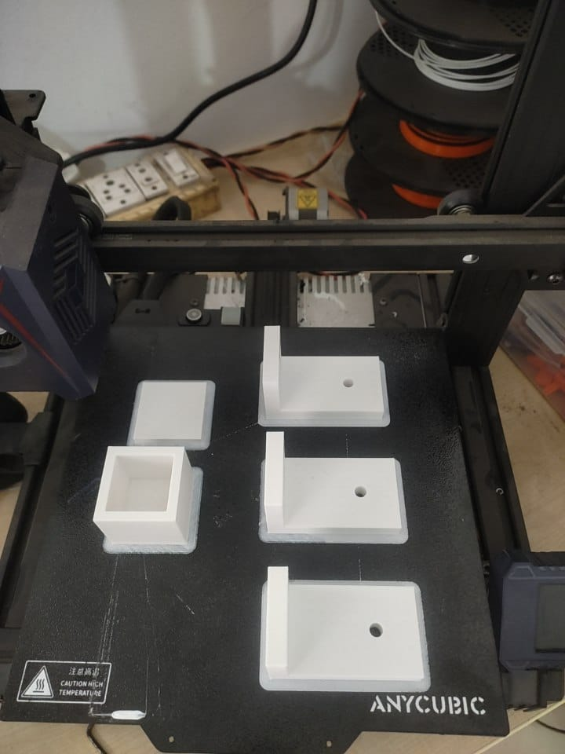

# 🤖 Warehouse Automation Robotic Arm with Conveyor Belt

An end-to-end robotics project that simulates a **warehouse pick-and-place system**, combining a **6-DOF robotic arm** with an **automated conveyor belt**.

This project documents the complete journey — from **3D printing and assembly** to **debugging real-world hardware failures** and achieving a working automation system.

---

## 📸 Project Preview

### 🔹 Robotic Arm

### 🔹  Converyor belt housing 3D printing

---

## 📽️ Demo Video

---

## 📌 Project Overview

This system mimics a basic warehouse workflow:

- Objects move on a **conveyor belt**
- An **IR sensor detects object position**
- A **robotic arm picks the object**
- The arm places it at a designated location

---

## 🛠️ Hardware Components

- Arduino Uno  
- 3 × MG90S Servo Motors  
- 3 × MG995 High Torque Servo Motors  
- LM2596 DC-DC Buck Converter (initially used)  
- IR Sensor Module  
- 3D Printed Robotic Arm Structure  
- Custom-designed Conveyor Belt (Fusion 360)  
- External Power Supply  

---

## 🧠 Software & Tools Used

- Arduino IDE  
- Fusion 360 (for conveyor design)  
- Serial Communication (manual control & testing)  

---

## 🧩 Project Journey

### 🔹 1. Ideation

We decided to build a **warehouse automation model** integrating:
- Robotic arm
- Conveyor belt system

Since we initially lacked experience in 3D modeling:
- Used an existing open-source 3D model
- Focused more on understanding assembly and motion

---

### 🔹 2. 3D Printing & Assembly

- Printed all structural components  
- Assembled joints using:
  - MG90S (for lighter joints)
  - MG995 (for high torque joints)  
- Integrated all servos with Arduino Uno  

---

### 🔹 3. Initial Control System

- Controlled arm using **Serial Communication**
- Sent commands via serial monitor to:
  - Move individual joints
  - Test motion range
- Defined safe angles to avoid mechanical stress  

---

### 🔹 4. Major Issue: Lag & Servo Failure ⚠️

We faced multiple real-world issues:

- Arm movement was **laggy and inconsistent**
- Servos were under **heavy mechanical load**
- Power supply using **LM2596 buck converter was insufficient**
- Even after using **two converters**, issue persisted  

❌ Result: **3 servos (gripper side) were damaged**

---

### 🔹 5. Root Cause & Fix ✅

After debugging, we identified:

👉 The **gripper servo was constantly under load**

### Solution:
- Locked the gripper at an **optimal fixed angle**
- Reduced continuous stress on the servo  

💡 Result:
- Stable operation  
- No further servo failures  
- Improved motion smoothness  

---

### 🔹 6. Conveyor Belt Development

- Designed conveyor belt using **Fusion 360**
- Built a working prototype  
- Integrated an **IR sensor** to:
  - Detect object arrival  
  - Stop conveyor at correct position  

---

### 🔹 7. Final System Integration

Workflow:

1. Conveyor moves object  
2. IR sensor detects object  
3. Conveyor stops  
4. Robotic arm picks object  
5. Arm places object at target location  

🎯 Achieved a complete **pick-and-place automation cycle**

---

## 🚀 Features

- 6-DOF robotic arm  
- Serial-based control system  
- Conveyor belt automation  
- IR-based object detection  
- Real-world debugging experience  

---

## ⚠️ Challenges Faced

- Power supply limitations  
- Servo overheating and failures  
- Mechanical load balancing  
- Synchronization between conveyor and arm  

---

## 📚 Key Learnings

- Importance of **proper power management in robotics**
- Hardware failures often come from **mechanical stress**
- Debugging requires **iteration and testing**
- Practical experience is critical beyond theory  

---

## 🔮 Future Improvements

- Implement **inverse kinematics for automation**
- Use **dedicated servo driver + better power supply**
- Add **computer vision (Aruco / object detection)**
- Upgrade to **ROS-based control**
- Improve gripper design for adaptive gripping  

---

## 🤝 Contribution

This project was built as part of hands-on learning in robotics, focusing on:

- Mechanical Design  
- Embedded Systems  
- Debugging Real Hardware Systems  

---

## ⭐ Final Note

This project represents a complete engineering journey:

**Idea → Design → Failure → Debugging → Working System**

---